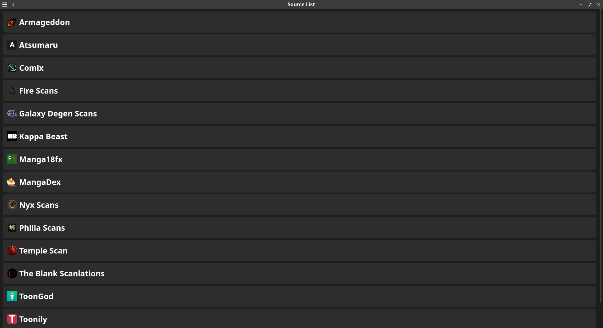
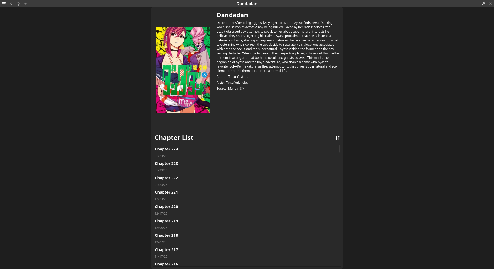
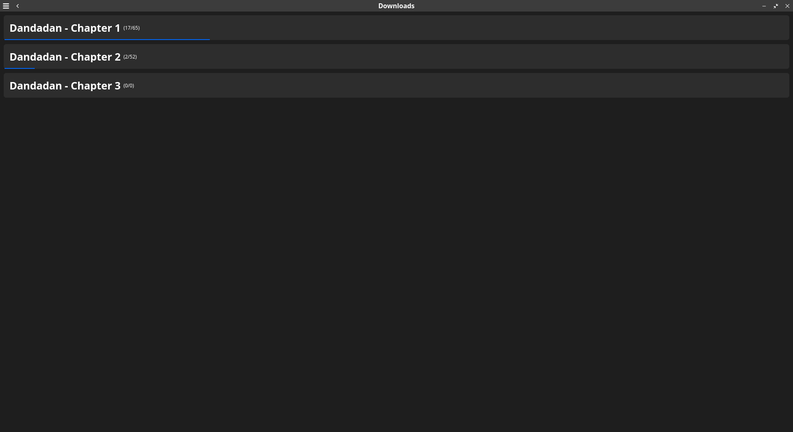
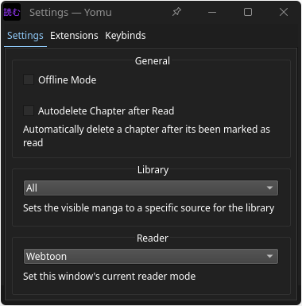

# Yomu

**Yomu** is a manga reader for Windows and Linux.

## License

**Yomu** is licensed under the [GPLv3](https://www.gnu.org/licenses/gpl-3.0.html)

## Features

* Reading using sources
* Downloading chapters locally for offline reading
    * Automatic deletion on read
* Webtoon and Right-To-Left reading modes
* Library categories
* Extendibility via extensions

## Supported Sources

* Armageddon
* Atsumaru
* Comick (Removed)
* Firescans
* Galaxy Degen Scans
* Kappa Beast
* Manga18fx
* Mangadex
* Mangafire (Removed)
* Nyx Scans
* Temple Scan
* The Blank Scans
* ToonGod
* Toonily
* WebtoonXYZ

Note: Sources may not be up to date

## Screenshots

    
Click to view images

## Usage

### Python
1. Clone the repository
2. Run `poetry install`
3. Activate the virtual environment
4. Run `python -m yomu`

### Executable
1. Download zip file from releases
2. Unzip the file
3. Run the executable
    * `yomu.exe` on Windows
    * `yomu-reader` on Linux

## Uninstall
1. Go to your local app data directory
    * Windows: `C:\\Users\\<name>\\AppData\\Local`
    * Linux: `~/.local/share`
2. Delete the Yomu folder